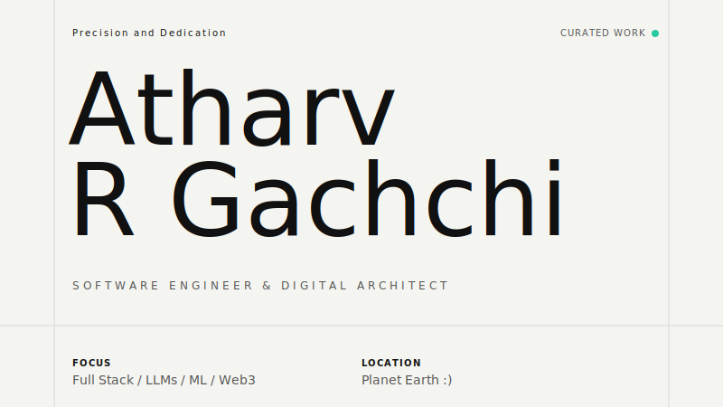
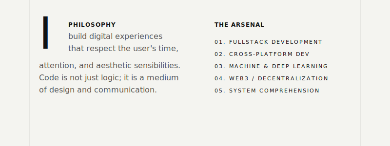

<!-- Hero Banner -->
<picture>
  
</picture>

<!-- Manifesto & Skills -->
<picture>
  
</picture>

 

<!-- Minimalist Project Directory -->
<table width="100%" style="border-collapse: collapse; border: none;">
  <tr>
    <td width="33%" align="left" style="border: none;">
      <h4 style="font-family: -apple-system, sans-serif; letter-spacing: 2px;">SELECTED WORKS</h4>
    </td>
    <td width="33%" align="center" style="border: none;">
      <h4 style="font-family: -apple-system, sans-serif; letter-spacing: 2px;">LATEST ESSAYS</h4>
    </td>
    <td width="33%" align="right" style="border: none;">
      <h4 style="font-family: -apple-system, sans-serif; letter-spacing: 2px;">CONTACT</h4>
    </td>
  </tr>
  <tr>
    <td align="left" style="border: none;">
      <a href="LINK_TO_PROJECT" style="text-decoration: none; color: inherit;"><i>Project Alpha</i> ↗</a>  
      <a href="LINK_TO_PROJECT" style="text-decoration: none; color: inherit;"><i>Project Beta</i> ↗</a>
    </td>
    <td align="center" style="border: none;">
      <a href="LINK_TO_BLOG" style="text-decoration: none; color: inherit;"><i>On Clean Architecture</i> ↗</a>  
      <a href="LINK_TO_BLOG" style="text-decoration: none; color: inherit;"><i>State Management</i> ↗</a>
    </td>
    <td align="right" style="border: none;">
      <a href="mailto:your@email.com" style="text-decoration: none; color: inherit;"><i>Email</i> ↗</a>  
      <a href="https://linkedin.com/in/YOUR_LINKEDIN" style="text-decoration: none; color: inherit;"><i>LinkedIn</i> ↗</a>
    </td>
  </tr>
</table>

 
 

  © 2026 ATHARV R.G. — ALL RIGHTS RESERVED.

